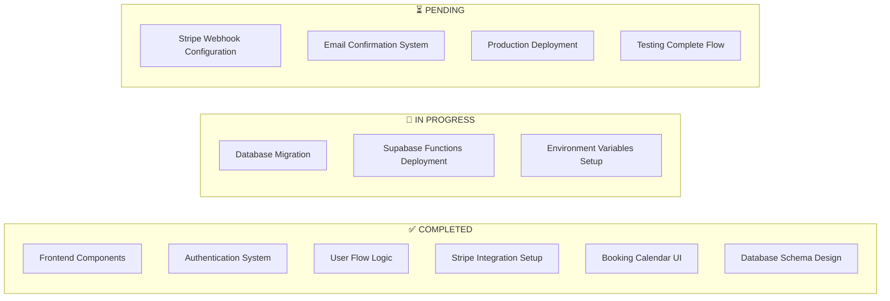
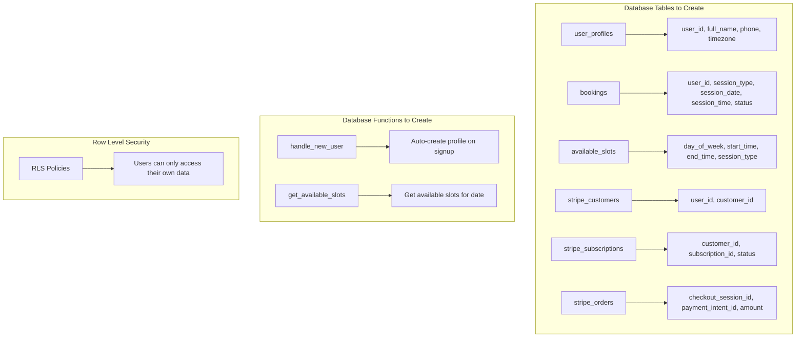
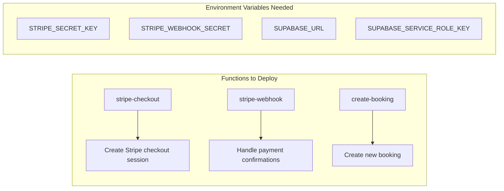
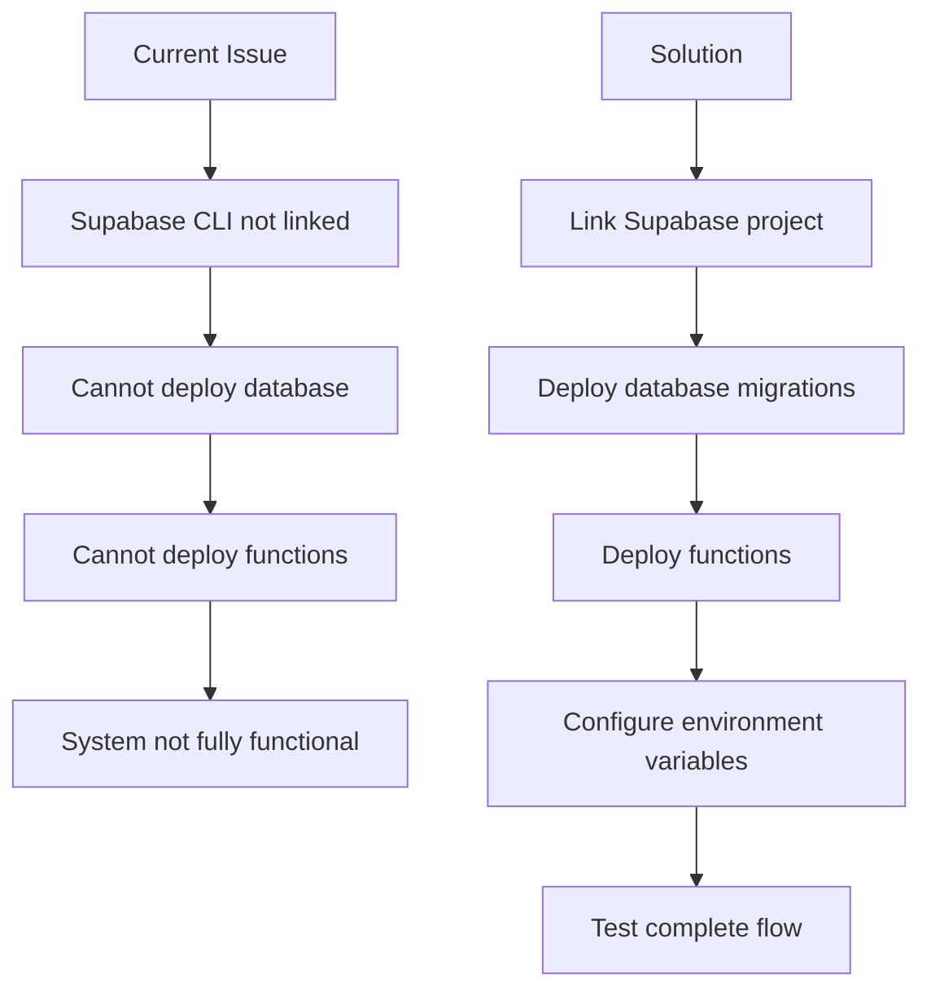
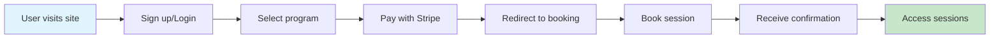

# 🚀 Complete Implementation Plan - Mountain Meditation & Yoga

## 📊 System Architecture Overview

```mermaid
graph TB
    subgraph "Frontend (React + Vite)"
        A[User visits site] --> B{User logged in?}
        B -->|No| C[Show "Start Your Journey"]
        B -->|Yes| D[Show "Explore Programs"]
        
        C --> E[User clicks button]
        E --> F[Redirect to /signup]
        F --> G[User creates account]
        G --> H[Store in Supabase Auth]
        H --> I[Redirect to /programs]
        
        D --> I
        I --> J[User sees programs]
        J --> K[User clicks "Get Started"]
        K --> L{User logged in?}
        L -->|No| M[Store product in sessionStorage]
        M --> N[Redirect to /login]
        N --> O[User logs in]
        O --> P[Retrieve product from sessionStorage]
        P --> Q[Call Stripe Checkout Function]
        
        L -->|Yes| Q
        Q --> R[Create Stripe Checkout Session]
        R --> S[Redirect to Stripe]
        S --> T[User completes payment]
        T --> U[Stripe Webhook triggered]
        U --> V[Update database tables]
        V --> W[Redirect to /booking]
        
        W --> X[Show Booking Calendar]
        X --> Y[User selects session time]
        Y --> Z[Confirm booking]
        Z --> AA[Send confirmation email]
        AA --> BB[User can access sessions]
    end

    subgraph "Backend (Supabase)"
        CC[stripe_customers]
        DD[stripe_subscriptions]
        EE[stripe_orders]
        FF[bookings]
        GG[user_profiles]
        HH[available_slots]
    end

    subgraph "Supabase Functions"
        II[stripe-checkout]
        JJ[stripe-webhook]
        KK[create-booking]
    end

    subgraph "External Services"
        LL[Stripe Payment]
        MM[Email Service]
    end
```

## 🔧 Current Implementation Status



## 🗄️ Database Implementation Plan



## 🔧 Supabase Functions Implementation



## 🎯 Step-by-Step Implementation Checklist

### Phase 1: Database Setup ✅
- [x] Create database migration files
- [x] Design user_profiles table
- [x] Design bookings table
- [x] Design available_slots table
- [x] Create RLS policies
- [ ] **Deploy database migrations** ⏳

### Phase 2: Supabase Functions ✅
- [x] Create stripe-checkout function
- [x] Create stripe-webhook function
- [ ] **Deploy functions to Supabase** ⏳
- [ ] **Set environment variables** ⏳

### Phase 3: Frontend Integration ✅
- [x] Create BookingCalendar component
- [x] Create BookingPage
- [x] Update routing
- [x] Update checkout service
- [x] Test user flow

### Phase 4: Stripe Configuration ⏳
- [ ] Set up Stripe webhooks
- [ ] Configure environment variables
- [ ] Test payment flow
- [ ] Test webhook handling

### Phase 5: Testing & Deployment ⏳
- [ ] Test complete user flow
- [ ] Test booking system
- [ ] Deploy to production
- [ ] Monitor and debug

## 🚨 Current Blockers



## 📋 Immediate Next Steps

1. **Link Supabase Project**
   ```bash
   npx supabase link --project-ref yloroyrwlfcvocwxtnta
   ```

2. **Deploy Database**
   ```bash
   npx supabase db push
   ```

3. **Deploy Functions**
   ```bash
   npx supabase functions deploy stripe-checkout
   npx supabase functions deploy stripe-webhook
   ```

4. **Set Environment Variables in Supabase Dashboard**
   - STRIPE_SECRET_KEY
   - STRIPE_WEBHOOK_SECRET
   - SUPABASE_URL
   - SUPABASE_SERVICE_ROLE_KEY

5. **Configure Stripe Webhooks**
   - Endpoint: `https://yloroyrwlfcvocwxtnta.supabase.co/functions/v1/stripe-webhook`
   - Events: checkout.session.completed, payment_intent.succeeded

6. **Test Complete Flow**
   - Sign up → Select program → Pay → Redirect to booking → Book session

## 🎉 Expected Final Result



## 🔍 Testing Checklist

- [ ] User can sign up
- [ ] User can log in
- [ ] User can select a program
- [ ] Payment flow works
- [ ] User is redirected to booking after payment
- [ ] User can book a session
- [ ] User can view their bookings
- [ ] User can cancel bookings
- [ ] Email confirmations work
- [ ] Database stores all data correctly

## 📞 Support Commands

```bash
# Check Supabase status
npx supabase status

# Link project
npx supabase link --project-ref yloroyrwlfcvocwxtnta

# Deploy database
npx supabase db push

# Deploy functions
npx supabase functions deploy stripe-checkout
npx supabase functions deploy stripe-webhook

# Start development server
npm run dev
```

---

**Status: 80% Complete - Ready for final deployment steps!** 